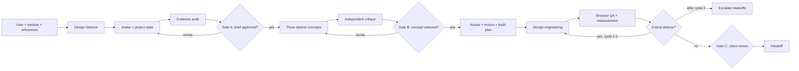
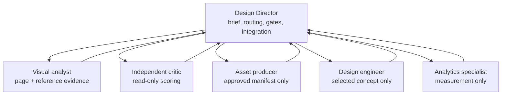

# Olympus architecture

## Workflow

## Routing table

| Need | Skill or capability | Activate when | Keep dormant when |
|---|---|---|---|
| Direct the run | `$olympus-design-director` | Always | Never |
| Diagnose existing UX/UI | `$ux-evidence-audit` | Existing page is supplied | Greenfield work with no existing interface |
| Decode references | `$reference-deconstruction` | Approved references exist | No references or only vague taste words |
| Generate directions | `$concept-studio` | Gate A is approved | Before diagnosis |
| Independent scoring | `$award-rubric` | Three concepts exist | During authorship or implementation |
| Plan media | `$asset-director` | Chosen concept has missing media | Existing approved assets are sufficient |
| Component polish | Impeccable + `$awwwards-web-design` | Concept is selected and hierarchy is stable | Early ideation |
| Timed/scroll motion | Official GSAP skills | Narrative sequencing justifies it | Decorative motion or simple CSS transition |
| 3D/WebGL | `$webgl-experience` | Unique communication value passes activation test | Generic spectacle, weak devices, tight budget |
| Measurement | `$design-analytics` | Goal and analytics scope are known | No consent, no baseline, or concept-only run |
| Release evidence | `$visual-qa` | An implementation exists | Before build |

## Roles

The arrows are contracts, not free-form conversation. Each specialist receives: objective, allowed files, required evidence, output path, stop condition, and what it must not do.

## MCP and tool layers

MCPs provide access; skills provide judgment. Connecting a service does not mean it should be called on every task.

| Layer | Preferred connection | Purpose | Trigger |
|---|---|---|---|
| Browser evidence | Codex browser control or Playwright CLI | Inspect, screenshot, test states | Audit and QA |
| Design source | Figma MCP | Frames, components, variables, assets | User supplies a Figma source |
| UI exploration | 21st.dev Magic MCP | Component inspiration/prototypes | Selected direction needs a net-new component pattern |
| Image/video | Higgsfield MCP | Approved media production | Asset manifest and user approval exist |
| Analytics | PostHog MCP | Baselines, funnels, events | Analytics is connected and in scope |
| Runtime debugging | Chrome DevTools MCP | Performance and browser diagnostics | Browser QA exposes a runtime/performance issue |

See `config/MCP-SETUP.md` for connection instructions and safeguards.

## Why the earlier all-at-once setup failed

Broad agents tend to load overlapping guidance, independently reinterpret the brief, generate before agreeing on hierarchy, and then critique moving targets. Every extra agent repeats context and creates another integration problem. The result is high token use with low design coherence.

Olympus instead uses one persistent interpretation of the brief, explicit human gates, activation tests for expensive tools, stable artifacts on disk, and a hard limit on revision loops.
